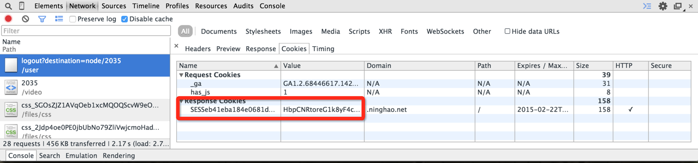
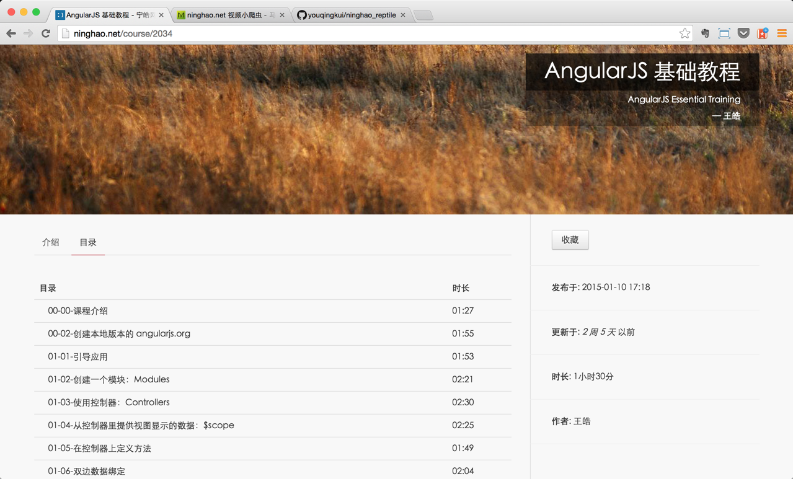

# ninghao.net 视频小爬虫

自从[ninghao.net](ninghao.net)推出视频下载，每次都要进入视频观看页面才能点击下载按钮下载视频，不能够一次性全部下载，所以尝试写个小程序去帮助下载。
- `npm install`   下载依赖
- 首先先去登入，打开控制台，查看登入后获取的session键值， 然后组装成类似这样的字符串:`'SESSeb=yoNFPAN'`,  即some=someting


- 去课程页面找课程， 然后复制URL


- `app.js` 代码中修改, ninghao 结束两个参数获取到得cookie， 以及下载的课程URL：
	```js
	// cookie 
	console.log(process.env.NingHao)
	down = new ninghao(process.env.NingHao, 'http://ninghao.net/course/2034')
	down.getUrl()
	```

- `node app` 


